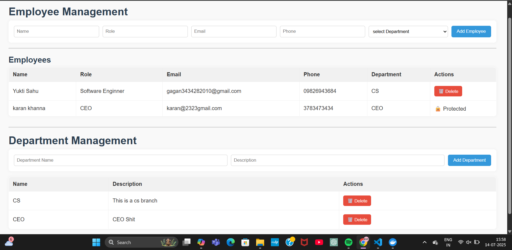

---

# 📋 Apollonia Employee Management System



A full-stack web application for managing employees and departments, built using Node.js, Express, MongoDB, and a minimalist HTML/CSS/JS frontend.

> 🚀 Developed as part of the [Coursera Showcase Project](https://www.coursera.org/learn/showcase-build-a-crud-nodejs-and-mongodb-employee-management-web-app/supplement/uKwPr/the-project-scenario) — *Build a CRUD NodeJS and MongoDB Employee Management Web App*

---


## 🌐 Live Demo
🚀 Application is Live! → [Employee Management System](https://employee-management-system-y2vo.onrender.com/)


---

## 🧩 Features

- 👥 **Employee Management**  
  Add, view, update, and delete employees. Each employee is linked to a department.

- 🏢 **Department Management**  
  Add, view, update, and delete departments.

- 🛡️ **Protected Role Handling**  
  Employees with the role `"CEO"` cannot be deleted via the UI.

- 🌐 **RESTful API Endpoints**  
  Clean and robust backend routes for employees and departments.

- 🖥️ **Responsive & Intuitive UI**  
  A sleek HTML/CSS/JS interface for seamless interaction.

---

## 🗂️ Project Structure

```txt
employee-management/
├── client/                # Frontend (HTML, CSS, JS)
│   ├── index.html
│   ├── script.js
│   └── style.css
├── server/                # Backend (Node.js, Express, MongoDB)
│   ├── config/
│   ├── controllers/
│   ├── models/
│   ├── routes/
│   ├── server.js
│   └── package.json
├── Dockerfile
├── docker-compose.yml
├── .env
├── .env.example
├── .gitignore
├── .dockerignore
├── README.md
└── image.png              # Project preview
```

---

## 🚀 Getting Started

### 🔧 Prerequisites

- [Node.js](https://nodejs.org/) (v18+ recommended)  
- [MongoDB Atlas](https://www.mongodb.com/cloud/atlas) or Local MongoDB  
- [Docker](https://www.docker.com/) *(optional: for containerization)*

---

### 🔐 Environment Setup

1. Copy `.env.example` to `.env`
2. Set the values for:

```env
MONGO_URL=your_mongodb_connection_string
PORT=3000
```

---

### 🧪 Local Development

1. **Install Backend Dependencies:**

```sh
cd server
npm install
```

2. **Start Backend Server:**

```sh
node server.js
```

3. **Access Frontend:**

- Open `client/index.html` manually  
- Or visit: `http://localhost:3000` *(if served via Express)*

---

### 🐳 Run with Docker

1. Build & Start with Docker Compose:

```sh
docker-compose up --build
```

2. Access Application:

- Frontend: `http://localhost:3000`  
- Backend API: `http://localhost:3000/api`

---

## 🔌 API Endpoints

### 🏢 Departments

| Method | Endpoint                    | Description             |
|--------|-----------------------------|-------------------------|
| GET    | `/api/departments`          | List all departments    |
| POST   | `/api/departments`          | Add new department      |
| PUT    | `/api/departments/:id`      | Update department info  |
| DELETE | `/api/departments/:id`      | Remove department       |

### 👥 Employees

| Method | Endpoint                   | Description              |
|--------|----------------------------|--------------------------|
| GET    | `/api/employees`           | List all employees       |
| POST   | `/api/employees`           | Add a new employee       |
| PUT    | `/api/employees/:id`       | Update employee info     |
| DELETE | `/api/employees/:id`       | Remove an employee       |

---

## 🛠️ Technologies Used

| Layer      | Tech Stack                        |
|------------|-----------------------------------|
| Backend    | Node.js, Express, Mongoose        |
| Frontend   | HTML, CSS, JavaScript             |
| Database   | MongoDB (Atlas or local)          |
| DevOps     | Docker, Docker Compose            |

---

## 🎨 Customization

- 🔧 Update `.env` with your MongoDB credentials  
- 🎨 Modify `client/style.css` for personalized styling  
- 🔒 Extend backend for features like authentication or role management

---

## 📄 License

This project is licensed under the **ISC License**.

---

## ✍️ Author

**Yukti Sahu**  
Crafted with precision and purpose.

---

